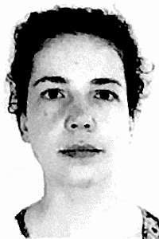
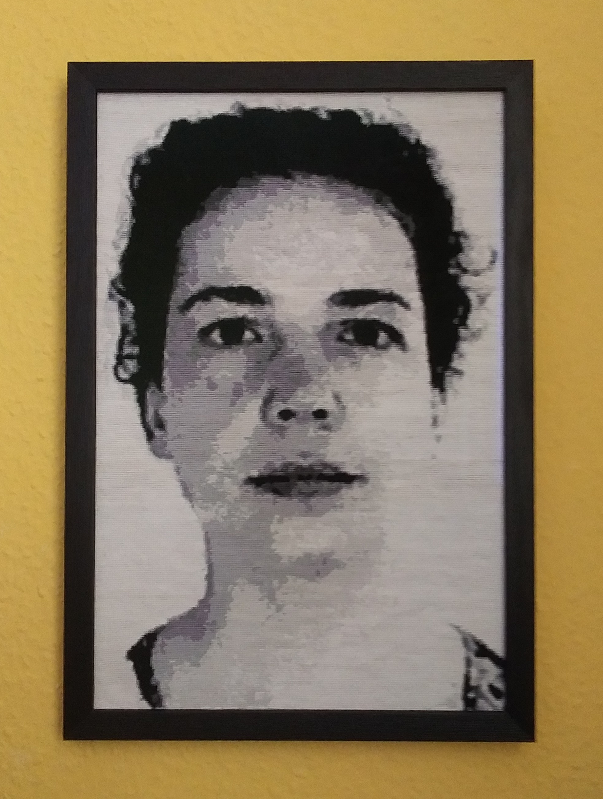
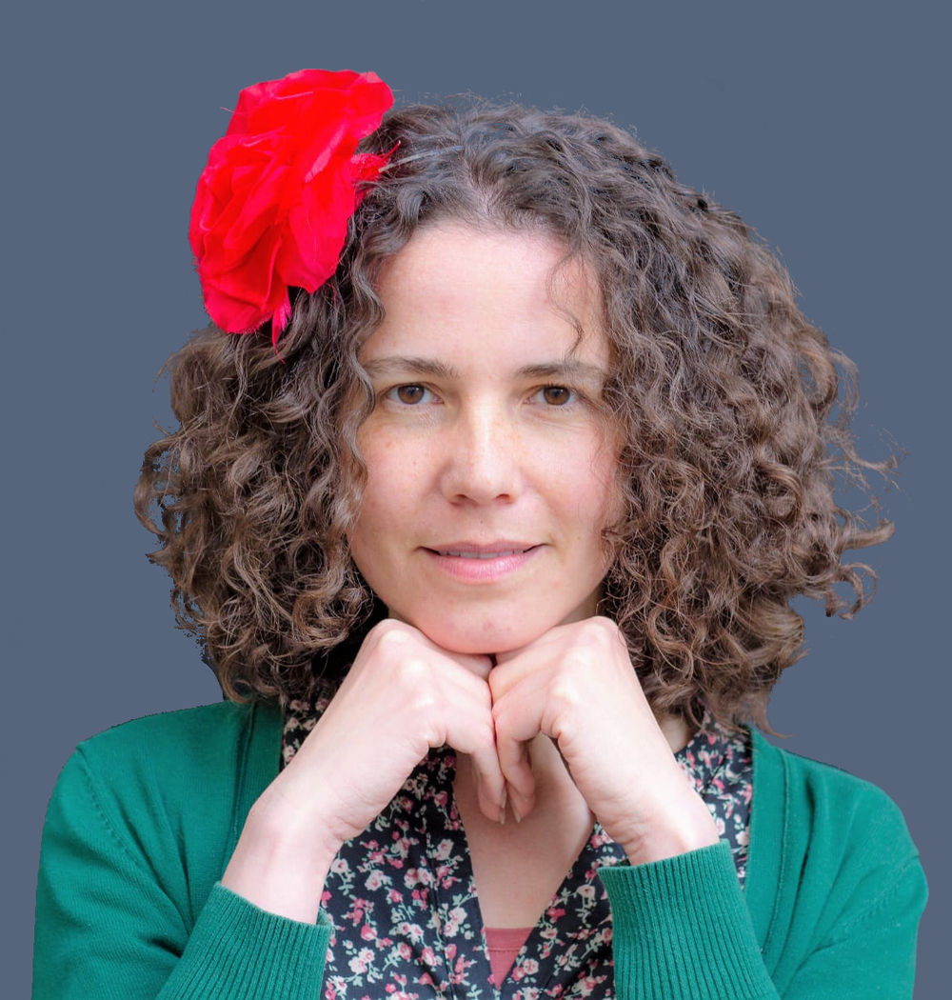
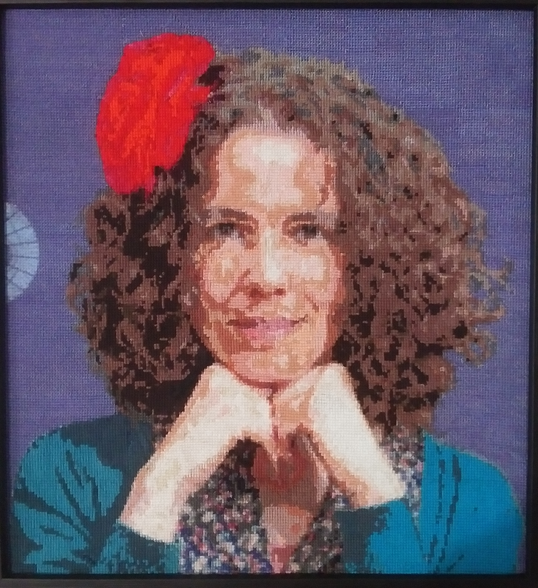

# Kreuzstich

Kreuzstich is a program designed to create complex photo-realistic cross-stitch patterns by converting an actual photo:
- Resize the picture to desired dimensions,
- Select for each pixel the best thread among a specific list (closest color),
- Generate a grid with the thread number for each pixel.

While this is somewhat similar to the online service provided by DMC, it has a stronger focus on photo-realism and doesn't limit the number
of threads to use or the size of the picture.

## Initial version

The initial version of Kreuzstich was rudimentary but was used to create several patterns over the course of several years:

| Original picture | Kreuzstich creation |
| :---: | :---: |
|  |  |
|  |  |
|  |  |

One of the main caveat of this version is that it doesn't allow editing. It simply selects the best color for each pixel of the
picture and may therefore create unnecessary complex patterns with lots of threads being used only for a few pixels.
While stitching the previous projects, I often made some modifications "on the fly" be replacing or removing some threads.

## Rewrite

### Motivation

I am currently working on a complete rewrite of the original application with more advanced features. The DMC application uses
image manipulation algorithms to reduce the number of colors used, which creates much simpler patterns but also creates loss in the quality
of the picture. The new version of Kreuzstich will not take this approach however and keep the basic principle of the initial version.

It will instead provide the user with a variety of tools to manually correct/simplify the pattern, e.g.:
- list threads usage statistics
- replace a specified thread by another
- edit/modify single pixels
- apply modifications to the whole picture or a selected area only

This will provide the user full control over the complexity of the pattern. In a picture of a face, for example, it can make sense to remove
unnecessary details from the skin, but keep every pixel as it is for the eyes.

The application will also provide features to help while doing the stitching:
- generate a grid for a specific area
- highlight a specific color
- mark finished pixels

### Objective

The long-term objective is to develop 3 applications:
- A desktop application for offline working.
- A web application that will also allow to save and share the projects online
- An Android companion app with limited features, which will be use to help during the stitching (no pattern creation/editing)

The priority and the extend of each application is still being defined.

### Technical aspects

The rewrite will use more modern technologies and better code quality than the initial version:
- Modern C++ (C++23)
- Qt6 instead of Qt4/5 for the desktop app
- Angular and WebAssembly for the web version
- Kotlin for the Android version
- Unit tests with Google Test

